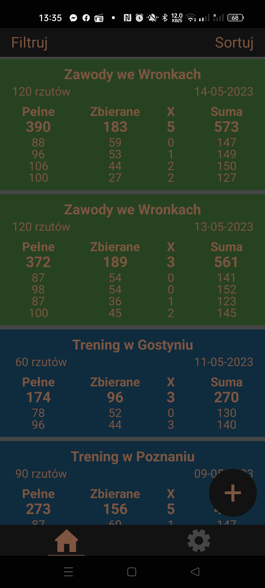
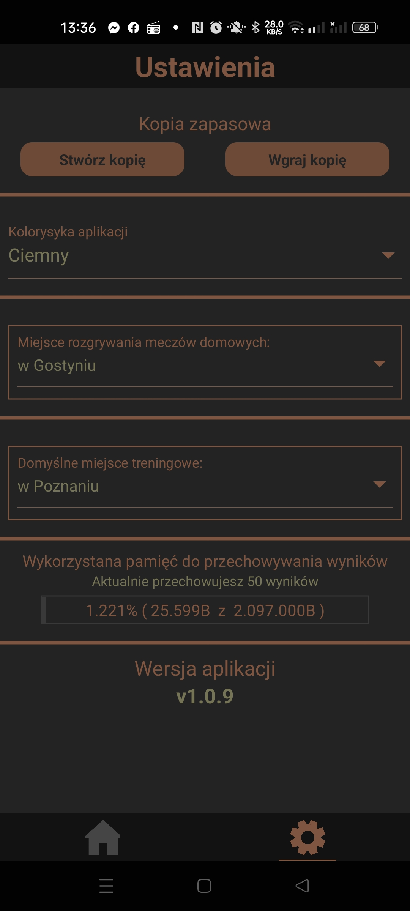
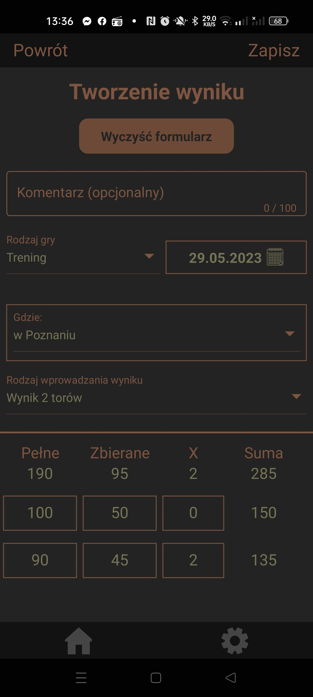

# Asystent kręglarza
- Aplikacja stworzona w React Native
- Aplikacja tworzona i testowana na telefonie z Androidem

Aplikacja została stworzona do przechowywania wyników uzyskanych podczas treningów, zawodów i meczów ligowych w kręglach klasycznych. W aplikacji wyniki można dodawać, edytować, sortować, filtrować oraz usuwać. Opcje filtrowania i sortowania są dostępne po kliknięciu odpowiednio przycisku "Filtruj" lub "Sortuj", ale została również zaimplementowana obsługa gestów, dzięki czemu panele z tymi opcjami można "wysunąć". W aplikacji są dostępnie dwie kolorystyki "Jasna" i "Ciemna". W ustawieniach można wybrać domyślne miejsce rozgrywania meczów ligowych oraz treningów, ta funkcja przyśpiesza dodawanie nowych rezultatów. W aplikacji została również dodana możliwość tworzenia kopii zapasowej z możliwością zapisania jej np w Dysku Google oraz możliwość wgrania kopii zapasowej.

# Wygląd aplikacji
## Ekran z wynikami

## Ekran ustawień

## Ekran służący do dodawania wyników

